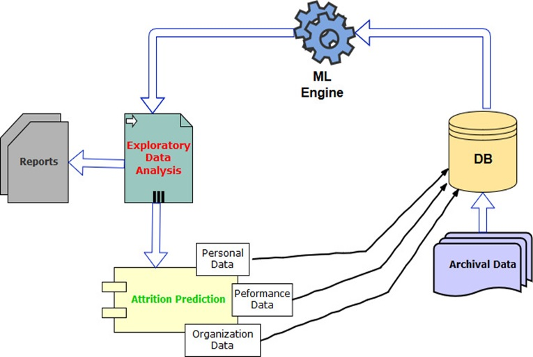

# EmployeeAttrition
IBM HR Analytics Employee Attrition &amp; Performance

Analysing the historical data of an Organization and predicting the Attrition rate. 
We are using machine learning algorithms to build prediction model for Attrition.

## Description
Uncover the factors that lead to employee attrition and explore important questions such as ‘show me a breakdown of distance from home by job role and attrition’ or ‘compare average monthly income by education and attrition’. This is a fictional data set created by IBM data scientists.

Education 1 'Below College' 2 'College' 3 'Bachelor' 4 'Master' 5 'Doctor'

EnvironmentSatisfaction 1 'Low' 2 'Medium' 3 'High' 4 'Very High'

JobInvolvement 
1 'Low' 2 'Medium' 3 'High' 4 'Very High'

JobSatisfaction 1 'Low' 2 'Medium' 3 'High' 4 'Very High'

PerformanceRating 
1 'Low' 2 'Good' 3 'Excellent' 4 'Outstanding'

RelationshipSatisfaction 
1 'Low' 2 'Medium' 3 'High' 4 'Very High'

WorkLifeBalance 1 'Bad' 2 'Good' 3 'Better' 4 'Best'

## System Overview

#### Global average software industry attrition rate seems to be  ~13.2% per year

#### Causes of Attrition – 
* Lack of Growth and Progression
* Being overworked
* Lack of Feedback and Recognition
* Changes in Organizational processes and policies

#### Impact of Attrition – 
* Loss of talent
* Productivity
* Profit

## Business Advantages
* Continuous ESAT improvement through predictive insights
* Inputs to strategic resource planning
* Thorough scanning of potential employees

## Futuristic View
* Sentiment based predictive analysis through multiple data sources like – corporate communication, social media, job portal site
* Recommendation through tool to control attrition
* Joining prediction model

### Refernce: https://www.kaggle.com/pavansubhasht/ibm-hr-analytics-attrition-dataset
